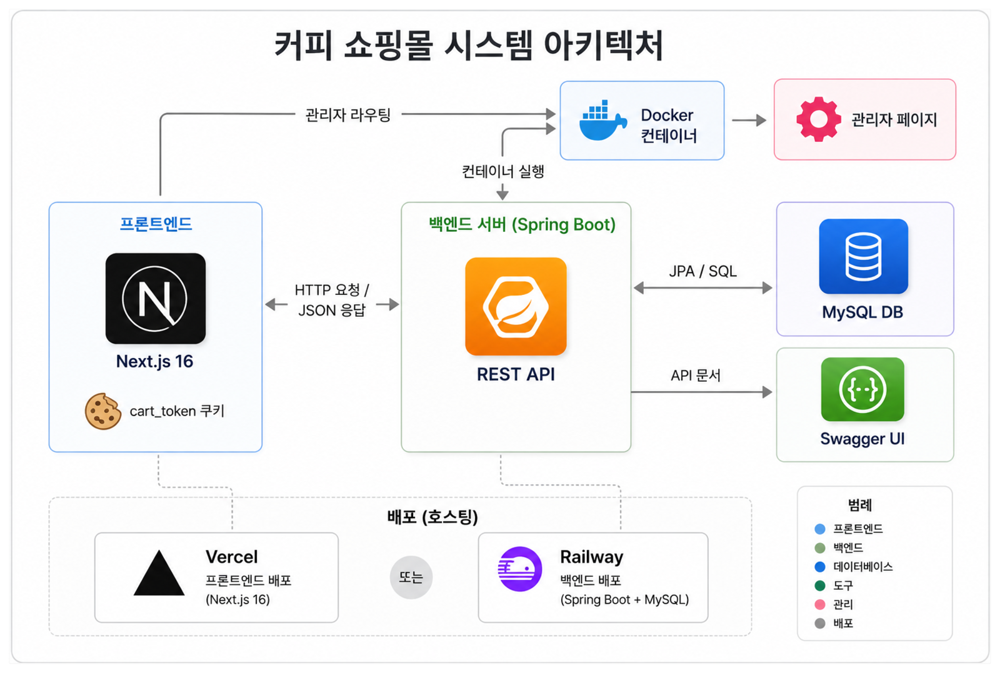
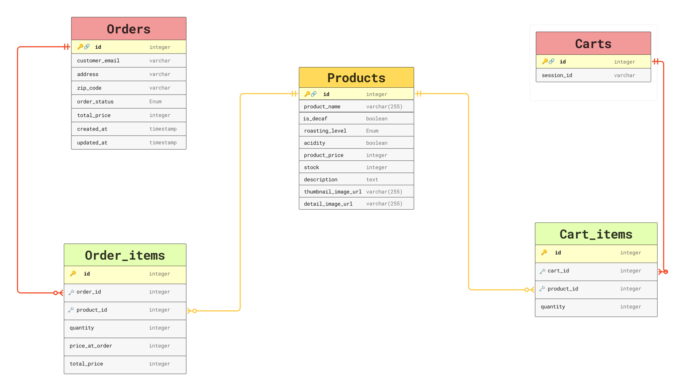

<!-- HEADER -->
<div align="center">


### ☕ 커피 원두 쇼핑몰 — Backend REST API

사용자 **상품 조회 · 장바구니 · 주문**, 관리자 **상품 · 주문 관리** 기능을 제공하는 Spring Boot REST API 서버입니다.

<br/>

[](https://be-production-9ee1.up.railway.app/swagger-ui/index.html)
[](https://be-production-9ee1.up.railway.app)

</div>

<br/>

## 🛠️ Tech Stack

<div align="center">


</div>

<br/>

| 분류 | 기술 |
|------|------|
| **Language** | Java 21 |
| **Framework** | Spring Boot 3.5 |
| **ORM** | Spring Data JPA (Hibernate) |
| **Database** | MySQL · H2 |
| **API 문서** | Swagger (springdoc-openapi) |
| **빌드 도구** | Gradle |
| **배포** | Railway (Docker) |

<br/>

## 🏗️ 시스템 아키텍처

<div align="center">
  
</div>

- 프론트엔드(관리자/사용자 페이지)는 모두 동일한 REST API 서버와 HTTP 통신
- 백엔드는 `Dockerfile` 기반으로 Railway에서 자동 빌드 및 배포
- 장바구니는 `cart_token` 쿠키로 비회원 식별

<br/>

## 🗂️ ERD

<div align="center">
  
</div>

- **Product** — 상품 정보 (사용자 조회 / 관리자 CRUD)
- **Order · OrderItem** — 주문 및 주문 상품 정보 (주문 시점 가격 저장)
- **Cart · CartItem** — 비회원 장바구니 (`cart_token` 기반)

<br/>

## 🚀 배포 정보

| 항목 | 내용 |
|------|------|
| 배포 플랫폼 | Railway |
| 서버 주소 | `https://be-production-9ee1.up.railway.app` |
| Swagger UI | [`/swagger-ui/index.html`](https://be-production-9ee1.up.railway.app/swagger-ui/index.html) |

<br/>

## 📌 API 목록

<details open>
<summary><b>🛍️ 사용자 - 상품 (Product)</b></summary>

<br/>

| Method | URL | 설명 |
|--------|-----|------|
| `GET` | `/api/products` | 상품 목록 전체 조회 (필터 가능) |
| `GET` | `/api/products/{id}` | 상품 단건 조회 |

**필터 파라미터** (모두 선택, 미입력 시 전체 조회)

| 파라미터 | 타입 | 설명 | 예시 |
|----------|------|------|------|
| `isDecaf` | Boolean | 디카페인 여부 | `true` |
| `roastingLevel` | String | 로스팅 단계 | `LIGHT` / `MEDIUM` / `DARK` |
| `acidity` | Boolean | 산미 여부 | `false` |

```
GET /api/products
GET /api/products?isDecaf=true
GET /api/products?roastingLevel=LIGHT
GET /api/products?isDecaf=true&roastingLevel=MEDIUM&acidity=false
```

</details>

<details>
<summary><b>🛒 사용자 - 장바구니 (Cart)</b></summary>

<br/>

> 쿠키 기반 비회원 장바구니입니다.
> 첫 상품 담기 시 `cart_token` 쿠키가 자동 발급되며 유효기간은 **3일**입니다.

| Method | URL | 설명 |
|--------|-----|------|
| `POST` | `/api/cart/items` | 장바구니 상품 등록 |
| `GET` | `/api/cart` | 장바구니 전체 목록 조회 |
| `PATCH` | `/api/cart/items/{cartItemId}` | 장바구니 상품 수량 수정 |
| `DELETE` | `/api/cart/items/{cartItemId}` | 장바구니 상품 삭제 |

**장바구니 등록 요청 예시**

```json
{
  "productId": 1,
  "quantity": 2
}
```

</details>

<details>
<summary><b>📦 사용자 - 주문 (Order)</b></summary>

<br/>

| Method | URL | 설명 |
|--------|-----|------|
| `POST` | `/api/orders` | 주문 생성 (재고 자동 차감) |
| `GET` | `/api/orders/{id}` | 주문 상세 조회 |
| `GET` | `/api/orders?email={email}` | 이메일로 주문 내역 조회 |

**주문 생성 요청 Body**

```json
{
  "customerEmail": "user@example.com",
  "address": "서울시 강남구",
  "zipCode": "06000",
  "items": [
    { "productId": 1, "quantity": 2 }
  ]
}
```

**주문 생성 응답 Body**

```json
{
  "orderId": 1,
  "customerEmail": "user@example.com",
  "address": "서울시 강남구",
  "zipCode": "06000",
  "orderStatus": "PROCESSING",
  "totalPrice": 9000,
  "createdAt": "2026-06-10T13:00:00",
  "deliveryDate": "2026-06-11",
  "orderItems": [
    {
      "productId": 1,
      "productName": "에티오피아 예가체프",
      "quantity": 2,
      "priceAtOrder": 4500,
      "totalPrice": 9000
    }
  ]
}
```

**주문 상태 (OrderStatus)**

| 값 | 설명 |
|----|------|
| `PENDING` | 주문 대기 |
| `PROCESSING` | 처리중 |
| `SHIPPING` | 배송중 |
| `DELIVERED` | 배송 완료 |
| `CANCELLED` | 취소 |

</details>

<details>
<summary><b>🔧 관리자 - 상품 (Admin Product)</b></summary>

<br/>

| Method | URL | 설명 |
|--------|-----|------|
| `GET` | `/api/admin/products` | 상품 목록 전체 조회 |
| `POST` | `/api/admin/products` | 상품 등록 |
| `PATCH` | `/api/admin/products/{productId}` | 상품 내용 수정 |
| `DELETE` | `/api/admin/products/{id}` | 상품 삭제 |
| `GET` | `/api/admin/products/best-selling` | 가장 많이 팔린 상품 조회 |

**가장 많이 팔린 상품 응답 예시**

```json
{
  "productId": 1,
  "productName": "에티오피아 예가체프",
  "productPrice": 4500,
  "totalSold": 120,
  "totalSalesAmount": 540000
}
```

</details>

<details>
<summary><b>🔧 관리자 - 주문 (Admin Order)</b></summary>

<br/>

| Method | URL | 설명 |
|--------|-----|------|
| `GET` | `/api/admin/orders` | 주문 목록 조회 (페이징 + 필터) |
| `GET` | `/api/admin/orders/grouped` | 주문 그룹 조회 (배송 묶음) |
| `PATCH` | `/api/admin/{orderId}/status` | 주문 상태 변경 |

**주문 목록 필터 파라미터**

| 파라미터 | 설명 | 예시 |
|----------|------|------|
| `order_status` | 주문 상태 필터 | `PENDING` |
| `product_name` | 상품명 검색 (부분 일치) | `콜롬비아` |
| `page` | 페이지 번호 (0부터 시작) | `0` |
| `size` | 페이지 크기 (기본값 10) | `10` |

```
GET /api/admin/orders
GET /api/admin/orders?order_status=PENDING
GET /api/admin/orders?product_name=콜롬비아&page=0&size=10
```

</details>

<br/>

## ✨ 주요 기능

| # | 기능 | 설명 |
|:-:|------|------|
| 1️⃣ | **상품 필터 조회** | 디카페인 여부 · 로스팅 단계 · 산미 여부를 조합해 필터링 (미입력 시 전체 조회) |
| 2️⃣ | **쿠키 기반 비회원 장바구니** | 로그인 없이 `cart_token` 쿠키로 장바구니 식별, 첫 등록 시 자동 발급 |
| 3️⃣ | **재고 자동 차감 + 동시성 제어** | 주문 생성 시 재고 자동 차감, 비관적 락(`SELECT FOR UPDATE`)으로 이중 차감 방지 |
| 4️⃣ | **배송 예정일 자동 계산** | 오후 2시 이전 주문 → 익일 / 이후 주문 → 익익일 배송 |
| 5️⃣ | **관리자 주문 그룹 조회** | 동일 이메일·주소·배송예정일 기준 묶음 조회, 배송 관리 활용 |

<br/>

## 📁 프로젝트 구조

```
src/main/java/com/team02/be/
├── config/          # 설정 (CORS, Swagger)
├── controller/      # API 엔드포인트
├── service/         # 비즈니스 로직
├── repository/      # DB 접근
├── entity/          # JPA 엔티티
├── dto/             # 요청/응답 DTO
└── exception/       # 예외 처리
```

<br/>

## ⚙️ 로컬 개발 환경 설정

<details>
<summary><b>1. MySQL 데이터베이스 생성</b></summary>

<br/>

```sql
CREATE DATABASE team02_db CHARACTER SET utf8mb4 COLLATE utf8mb4_unicode_ci;
```

</details>

<details>
<summary><b>2. application.yaml 설정</b></summary>

<br/>

`src/main/resources/application.yaml`의 비밀번호를 본인 MySQL 비밀번호로 수정합니다.

```yaml
server:
  port: 8080

spring:
  datasource:
    url: jdbc:mysql://localhost:3306/team02_db?serverTimezone=Asia/Seoul&characterEncoding=UTF-8
    username: root
    password: 본인_비밀번호
    driver-class-name: com.mysql.cj.jdbc.Driver

  jpa:
    hibernate:
      ddl-auto: update
    show-sql: true
```

</details>

<details>
<summary><b>3. 서버 실행 & Swagger 확인</b></summary>

<br/>

```bash
./gradlew bootRun
```

```
http://localhost:8080/swagger-ui/index.html
```

</details>

<br/>

## 🌿 브랜치 전략

```
feat/*  ─►  dev  ─►  main
```

| 브랜치 | 설명 |
|--------|------|
| `main` | 운영 배포 브랜치 |
| `dev` | 통합 개발 브랜치 |
| `feat/*` | 기능 개발 브랜치 |

<br/>

## 👥 팀원 소개

| 이름 | 역할 |
|------|------|
| **임승빈** | 장바구니 수량 변경/상품 제거 API · 사용자 주문 조회 API · 상품 단건 조회 API |
| **채성현** | 백엔드 시스템 아키텍처 설계 · Swagger 문서화 환경 세팅 · 관리자 상품 등록/수정/주문 필터링 API · 장바구니 담기/조회 API |
| **최현승** | GitHub 협업 환경 세팅 (브랜치 전략·Issue/PR 템플릿·머지 규칙) · ERD 설계 및 Cart/CartItem 엔티티 설계 · 상품 전체 목록 조회/필터링 API · Swagger 문서화 환경 세팅 |
| **이준영** | 백엔드 시스템 아키텍처 설계 · 관리자 주문 상태 변경 API · 관리자 상품 목록 조회 API |
| **한철완** | 주문 생성 및 주문 목록 조회/상품 삭제 API · 백엔드 및 DB 배포 환경 구축 (Railway) · 정기 회의 및 멘토링 서기 |

<br/>

<!-- FOOTER -->
<div align="center">


</div>
